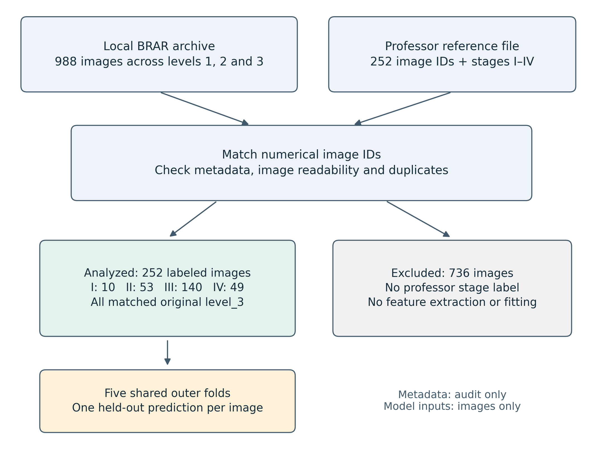
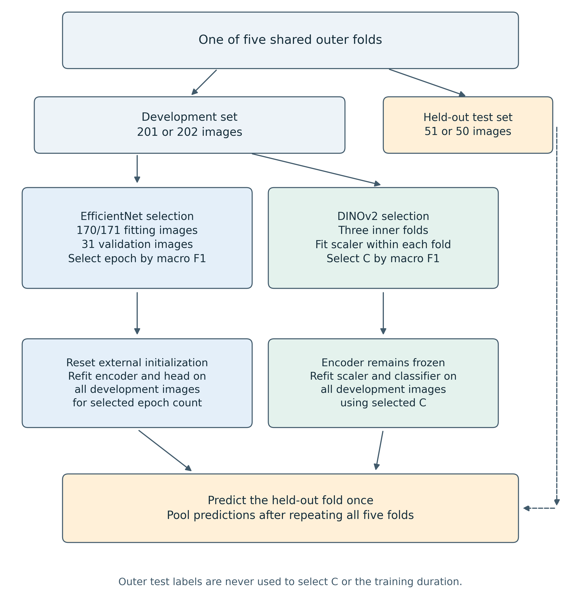
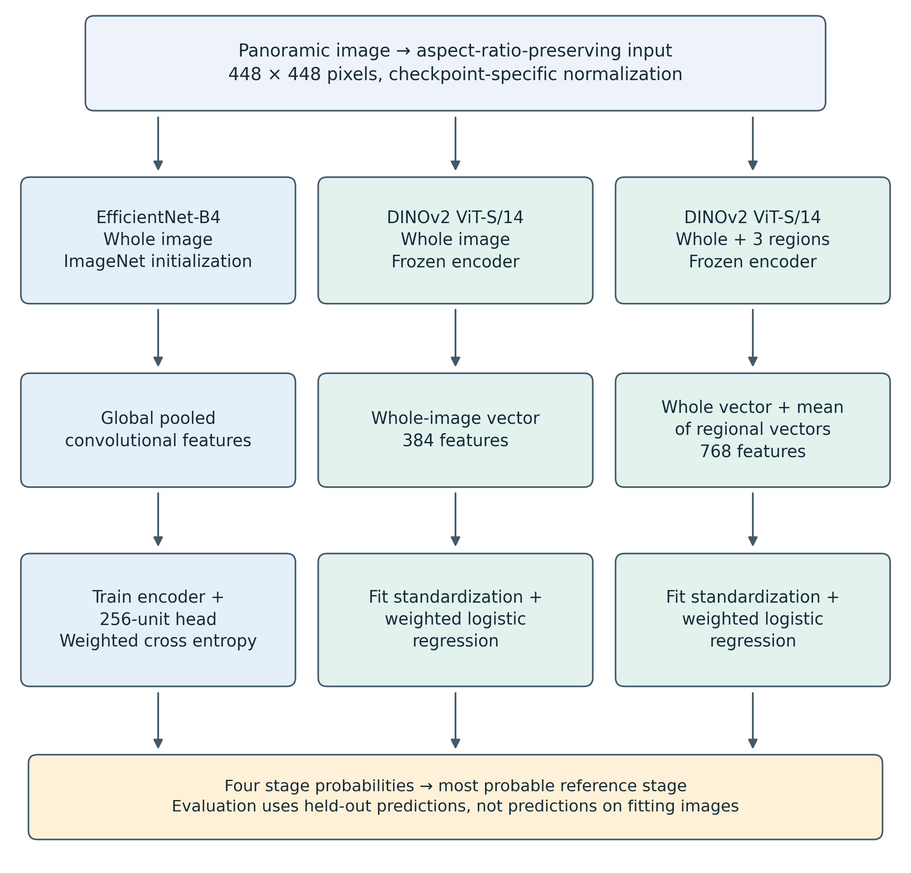

# 1. INTRODUCTION

Periodontal assessment requires the interpretation of disease severity in the context of the available clinical and radiographic evidence. The classification developed through the 2017 World Workshop and published in 2018 distinguishes stage, which describes severity and management complexity, from grade, which concerns progression and associated risk. Consequently, reproducing a stage label from a radiograph is a narrower task than establishing a complete periodontal diagnosis. This distinction is central to the present study. [Tonetti et al. (2018)](https://doi.org/10.1002/JPER.18-0006)

Panoramic radiographs offer a view of the dentition and surrounding structures within a single image. Their broad coverage makes them relevant to computational assessment at the image level, but creates a demanding recognition problem: a classifier must relate local visual features to an overall case label. As discussed in the literature review, the apparent success of radiographic artificial intelligence depends on the imaging modality, annotation criteria, class distribution, and evaluation design. A high accuracy value cannot by itself establish that an algorithm has learned the distinctions required by the clinical classification framework.

The BRAR dataset provides a practical setting in which to examine these issues. It combines panoramic radiographs with demographic information and annotations concerning bone resorption and dental status. Its original organizing variable is the Bone Resorption Age Ratio, rather than a four-stage clinical classification. This study uses a separately annotated subset for which a supervising professor supplied Stage I–IV assignments. The BRAR source and the professor-assigned stages therefore serve different roles: the former provides the images and existing metadata, while the latter defines the supervised prediction target. [Xia et al. (2025)](https://doi.org/10.1038/s41597-025-06400-y)

The available stage-labeled subset contains 252 images, with only ten assigned to Stage I. This creates two related challenges. First, models may fit characteristics of the observed sample without learning features that transfer reliably to unseen cases. Second, aggregate accuracy may conceal poor recognition of an underrepresented stage. These constraints motivate an evaluation that considers both the learning approach and the distribution of errors across stages.

The primary convolutional approach in this project is EfficientNet-B4. The study compares its supervised fine-tuning with an alternative that extracts fixed features from a pretrained DINOv2 encoder and learns only a small classifier from the BRAR stage labels. A further DINOv2 variant combines whole-image features with regional features to examine whether retaining more local image information changes performance. These alternatives require no additional stage annotation and can be evaluated using the same images and held-out folds.

The aim is to assess how these approaches reproduce the professor-assigned stages under limited and imbalanced supervision. The contribution is an audited comparison of complete learning pipelines, accompanied by an explicit account of dataset selection, label provenance, and uncertainty. The study does not assume that a newer representation will outperform the existing convolutional model. It also does not evaluate automated progression grading, disease screening against confirmed healthy controls, or prospective clinical decision-making.

The literature review in Chapter 2 establishes the clinical and methodological context. The following chapters define the research questions, describe the available dataset, explain the experimental procedure, and present the results and their limitations.

# 3. RESEARCH QUESTIONS / HYPOTHESES

The study addresses three research questions. They concern prediction of the available reference labels and do not presuppose that those labels constitute a fully documented clinical diagnosis.

**RQ1. How does frozen DINOv2 feature extraction compare with supervised EfficientNet-B4 fine-tuning for four-stage prediction in the annotated BRAR subset?** The primary comparison uses macro-averaged F1, supported by balanced accuracy and stage-specific recall. The directional working hypothesis, H1, is that a frozen representation with a regularized classifier may improve macro F1 by reducing the amount of model fitting required from the limited labeled sample.

**RQ2. Does combining whole-image and regional DINOv2 representations improve prediction compared with a whole-image representation alone?** The working hypothesis, H2, is that regional features may retain information that is less accessible after a complete panorama is reduced to the model input size. This is assessed through the observed differences in macro F1, accuracy, and ordinal error between the two DINOv2 variants.

**RQ3. How does predictive performance differ between stages, particularly between the sparsely represented Stage I and the more prevalent advanced-stage labels?** The working expectation, H3, is that performance will be uneven across stages, with lower recall for Stage I. Stage-specific recall and confusion matrices are used to determine whether improvements in overall accuracy are accompanied by improvements in minority-stage recognition.

These are exploratory research questions and directional expectations, not preregistered confirmatory hypotheses. The dataset and a historical pilot evaluation had been examined before the comparative study. Accordingly, the analysis reports effect estimates and uncertainty without treating an observed model ranking as definitive evidence of superiority. A hypothesis that is not supported remains a substantive result of the comparison.

# 4. DATASET

## 4.1. Source and locally available material

The study used the locally available BRAR panoramic radiographs and accompanying CSV metadata. The source publication describes a cohort of 1,104 patients, whereas the local image archive and metadata used in this work contain 988 image records. The present analysis is based on the verified local files; the difference from the published cohort size is not attributed to exclusions performed in this study. [Xia et al. (2025)](https://doi.org/10.1038/s41597-025-06400-y)

The local images are organized into three original BRAR folders: level_1, level_2, and level_3, containing 170, 560, and 258 images, respectively. These original categories must not be equated with Stage I, Stage II, and Stage III. Four-stage reference labels were supplied separately in 2017_classification.csv, a semicolon-separated file containing the numerical image identifier and the assigned stage.

Each label was linked to its image by extracting the numerical identifier from the image filename. The matching procedure searched all three BRAR folders and joined the corresponding metadata record by the same identifier. The audit found 252 labeled images, with no missing corresponding images or metadata rows and no duplicate labeled identifiers. The remaining 736 images lacked the professor-assigned four-stage target and were not used for model fitting or feature extraction in this comparison.

## 4.2. Reference labels and sample composition

The professor classified a subset of the existing BRAR material. No additional clinical records were supplied to this project. The available documentation does not establish whether numerical metadata were consulted alongside the radiographs, nor does it provide a reproducible adjudication protocol for the four-stage assignments. The labels are therefore described as professor-assigned reference stages. Agreement with these labels is the operational endpoint of the study; inter-rater reliability and agreement with an independently adjudicated clinical reference were not measured.

All 252 labeled identifiers currently resolve to images in the original level_3 folder. The supervised subset therefore covers most of that original category but does not represent the full distribution of the local BRAR archive. Its composition is shown in Table 4.1.

Table 4.1. Distribution of professor-assigned stage labels.

| Reference stage | Images | Percentage |
| --- | ---: | ---: |
| Stage I | 10 | 3.97% |
| Stage II | 53 | 21.03% |
| Stage III | 140 | 55.56% |
| Stage IV | 49 | 19.44% |
| Total | 252 | 100.00% |

Age in the labeled subset ranged from 18 to 75 years, with a mean of 42.08 years, a sample standard deviation of 14.73 years, and a median of 38.5 years. The metadata column named Gender contained 132 records coded 0 and 120 coded 1. These codes were not interpreted as named categories without a verified coding definition. The image widths ranged from 2,771 to 2,976 pixels and the heights from 1,316 to 1,536 pixels. These statistics describe the analyzed files, not the full cohort reported in the source publication.

## 4.3. Metadata and annotation consistency

Available metadata include age, the encoded gender variable, bone resorption, bone resorption relative to age, original BRAR level, missing-tooth count, implant count, residual-root count, and a field named Functional tooth logarithm. These fields were retained for data auditing but were not supplied to any of the three models. Consequently, the experiments evaluate image-only predictors rather than systems receiving expert-measured bone loss at inference time.

The numerical scale of the local bone-resorption variables was checked. If r denotes the fractional value in Bone resorption and a denotes age in years, the stored Bone resorption Age variable agrees, to numerical rounding, with:

BRAR_percent = (100 × r) / a.

Thus, a bone-resorption value of 0.2237 denotes approximately 22.37% on the percentage scale. This distinction is necessary when relating a fractional measurement to percentage-based grading thresholds. The formula describes the local metadata; the study did not train or validate a grading model.

A substantive annotation discrepancy was observed. The ten Stage I cases had bone-resorption metadata values ranging from approximately 21.8% to 41.7%, whereas the Stage I radiographic criterion in the classification framework is below 15%. The discrepancy may involve measurement definitions, image–metadata correspondence, or the criteria applied during annotation. The available material does not determine its cause. Both sources were preserved, and labels were not replaced with thresholds derived from the metadata. [Tonetti et al. (2018)](https://doi.org/10.1002/JPER.18-0006)

## 4.4. Unit of analysis and data governance

The unit of analysis was the labeled panoramic image. The implemented split design assumed that each numerical image identifier represented a separate patient because an independently verified patient grouping file was not available. Exact decoded-image hashes were checked within the labeled subset, and no duplicates were detected. This does not exclude near-duplicate radiographs or unrecorded repeat examinations of the same patient.

The work was a secondary analysis of existing dataset files; no patients were recruited and no additional imaging was acquired for these experiments. The original dataset publication describes anonymized image identifiers. No new ethics approval, waiver, or consent procedure is asserted here for the secondary analysis without institutional documentation. [Xia et al. (2025)](https://doi.org/10.1038/s41597-025-06400-y)

# 5. METHODOLOGY

## 5.1. Study design and relationship to the earlier pipeline

The experiment compared three image-only approaches: EfficientNet-B4 fine-tuning, frozen DINOv2 whole-image features with logistic regression, and frozen DINOv2 whole-image plus regional features with logistic regression. EfficientNet-B4 was retained as the primary convolutional approach because it was the model implemented in the earlier project.

The earlier pilot used a single training/validation/test partition and initialized the stage classifier from a previous BRAR classifier. Its test result is distinguished from the present comparison because the evaluation sample and initialization history differ. The five-fold study used an external ImageNet checkpoint for EfficientNet and did not reuse the old BRAR checkpoint. It also used aspect-ratio-preserving preprocessing. The comparison consequently evaluates complete learning approaches rather than isolating architecture as the only experimental variable.

Figure 5.1. Dataset assembly. All three original folders were searched, but all 252 stage-labeled images matched level_3. The 736 images without professor-assigned stages were excluded from the comparison. Metadata supported the audit and was not a model input.

## 5.2. Shared outer folds and internal model selection

The 252 labeled images were divided into five stratified outer folds using random seed 42. Identical outer folds were used for every method. Three folds contained 50 test images and two contained 51; each outer test fold contained two Stage I cases. The resulting development sets contained 201 or 202 images. Each image appeared in one outer test fold and received exactly one held-out prediction per method.

All model selection was performed within the corresponding outer development set. DINOv2 classifiers used three inner stratified folds to select regularization strength. EfficientNet used a stratified internal validation subset, approximately 15% of the development set, to choose the number of training epochs. This internal subset contained 31 images in each outer fold. These are different internal selection procedures, but neither uses the outer test labels to choose model settings.

The software supports grouped splitting when a patient mapping is supplied. In the present run, identifiers were unique and no separate patient mapping was supplied, so stratification operated over the individual image records. No claim of independently verified patient-level separation is made beyond the identifier assumption described in Section 4.4.

Figure 5.2. Evaluation within one outer fold, repeated five times. DINOv2 regularization and EfficientNet training duration are selected using development data. The selected approach is then fitted on the full outer development set before predicting the held-out fold. Preprocessing parameters learned from data are confined to the relevant fitting partitions.

## 5.3. Image preparation and regional views

Images were decoded, corrected for stored EXIF orientation where present, and converted to three-channel RGB. Each model input was resized to fit within 448 × 448 pixels while preserving aspect ratio, with black padding filling the remaining area. Normalization used the mean and standard deviation specified by the corresponding pretrained checkpoint. Whole-image preprocessing retained the full field of view rather than applying a central crop that could remove lateral anatomy.

EfficientNet training used horizontal flipping with probability 0.5, random rotations within ±8 degrees, and brightness and contrast jitter with magnitude 0.12. These transformations were applied only to fitting images. Validation and test preprocessing were deterministic. No synthetic stage labels, generative augmentation, segmentation masks, or manually annotated tooth crops were introduced.

The regional DINOv2 variant used the complete panorama and three additional square crops located at the left, center, and right of the image. For the panoramic images in this dataset, each crop spanned the image height. The crops overlapped and were defined geometrically, without tooth detection or landmark localization. All views of an image remained associated with that image throughout the experiment; they were not counted as separate observations.

## 5.4. Primary convolutional approach: EfficientNet-B4

EfficientNet is a convolutional model family developed through a structured approach to network scaling. The present implementation used EfficientNet-B4 with the timm checkpoint efficientnet_b4.ra2_in1k, initialized from ImageNet pretraining. This choice retained the architecture used in the earlier project while removing dependence on the old BRAR-trained weights. [Tan and Le (2019)](https://proceedings.mlr.press/v97/tan19a.html)

The original classification layer was replaced by global average pooling and a four-stage classification head. The head consisted of dropout with probability 0.4, a fully connected layer with 256 units, a rectified linear activation, dropout with probability 0.2, and a final four-output layer. Both the encoder and the head were trainable.

Training used AdamW with a base learning rate of 0.0001 and weight decay of 0.01. The learning rate used a three-epoch warm-up followed by cosine decay over a maximum planned duration of 60 epochs. Batch size was four, mixed precision was enabled on CUDA, and gradient norms were clipped to 1.0. The objective was class-weighted cross entropy with label smoothing of 0.05. For each fitting partition, the weight for class k was computed as:

w_k = N / (4 × n_k),

where N is the number of fitting images and n_k is the number with reference stage k. Weights were recalculated from the fitting data rather than from the complete dataset.

During internal model selection, training stopped after 15 consecutive epochs without improvement in validation macro F1. The epoch with the highest validation macro F1 was selected, with the earliest epoch retained in a tie. The model was then reinitialized to the same external encoder weights and initial random head and fitted on the entire outer development set for that number of epochs. The refit followed the original planned learning-rate schedule rather than compressing it to the selected duration. Only after refitting were predictions obtained for the outer test fold.

## 5.5. Comparison approach: frozen DINOv2

DINOv2 learns visual representations through self-supervised pretraining. Here, the pretrained ViT-S/14 encoder was used as a fixed feature extractor rather than fine-tuned on the BRAR labels. The timm checkpoint was vit_small_patch14_dinov2.lvd142m. Its parameters remained frozen and the model operated in evaluation mode. [Oquab et al. (2023)](https://arxiv.org/abs/2304.07193)

For the whole-image variant, each panorama produced a 384-dimensional feature vector. For the regional variant, the three regional vectors were averaged and concatenated with the whole-image vector, producing a 768-dimensional representation:

z_combined = concatenate(z_global, (z_left + z_center + z_right) / 3).

Features were extracted on CUDA and cached before classifier fitting. This operation did not learn from BRAR labels or modify the encoder. In particular, no data-fitted normalization, dimensionality reduction, or classifier was fitted on the complete feature matrix. Each cached feature row remained linked to its image identifier.

A class-weighted multinomial logistic-regression classifier was fitted to the features. Feature standardization and classification were implemented as a single scikit-learn pipeline so that the standardization parameters were learned separately within each inner training fold. The inverse regularization parameter C was selected from 0.01, 0.1, 1, and 10 using mean inner-fold macro F1. The classifier used the L-BFGS solver, balanced class weights, and a maximum of 5,000 iterations. The selected pipeline was refitted on all outer development images before predicting the outer test images. Classifier fitting took place on CPU; image feature extraction used the GPU.

Figure 5.3. The three compared pipelines. EfficientNet learns both encoder and head parameters from the fitting images. DINOv2 is frozen, with only standardization and logistic regression fitted on the study data. Regional crops contribute to one image representation, not additional independent training cases.

## 5.6. Outcome measures and uncertainty

Macro F1 was the primary comparison measure because it gives equal weight to each stage. For each stage, F1 combines precision and recall; macro F1 is their unweighted mean across the four stages. Balanced accuracy was computed as the mean of the four stage recalls. Ordinary accuracy and the confusion matrix were also reported to show the total number of correct predictions and the directions of misclassification.

The ordered nature of the labels was examined through mean absolute stage error and quadratic weighted kappa. Mean absolute stage error was calculated as:

MAE_stage = (1 / N) × sum(|y_i − predicted_y_i|).

This statistic describes the number of stage positions separating reference and prediction; it does not imply that adjacent clinical stages are separated by equal biological distances. Log loss was included to summarize the assigned probabilities, but no probability-calibration procedure or clinical confidence threshold was evaluated.

The principal reported measures were calculated from pooled out-of-fold predictions. Fold-specific measures were retained to show sensitivity to partitioning. Conditional 95% bootstrap intervals for macro F1 were estimated from 1,000 resamples of patient-identifier groups within stage. The same sampled groups were used across methods when estimating differences against EfficientNet. These intervals describe uncertainty in fixed out-of-fold predictions conditional on the observed class distribution. They do not account for retraining variability, uncertainty in the reference labels, or transport to another population. They were not used to claim formal equivalence between methods.

## 5.7. Implementation and verification

Experiments were executed in the existing Windows environment using an NVIDIA GeForce RTX 4060 with 8 GB of GPU memory. The recorded software included Python 3.12.10, PyTorch 2.6.0 with CUDA 12.4 support, torchvision 0.21.0, timm 1.0.27, scikit-learn 1.5.2, and NumPy 2.4.3. EfficientNet training used CUDA automatic mixed precision. Random seeds were set for Python, NumPy, and PyTorch, and deterministic cuDNN settings were requested; exact reproducibility across different hardware or library versions was not assumed.

Source CSV hashes, image hashes, split assignments, configuration snapshots, feature-cache identifiers, trained checkpoints, and per-image predictions were retained. After training, all 15 fold checkpoints were reloaded and their held-out predictions were reproduced. Predicted classes matched exactly, and the largest absolute probability difference was below 3 × 10^-8. The verification also checked the recorded development/test memberships and the consistency between EfficientNet's selected epoch and refit duration.

# 6. RESULTS

## 6.1. Overall held-out performance

Table 6.1 summarizes the pooled predictions for the same 252 images. Regional DINOv2 produced the highest observed ordinary accuracy and the lowest mean absolute stage error. EfficientNet produced the highest balanced accuracy and quadratic weighted kappa. Their macro F1 values were close.

Table 6.1. Five-fold out-of-fold performance. Higher values are preferable except for stage MAE and log loss.

| Method | Accuracy | Balanced accuracy | Macro F1 | Stage MAE | Weighted kappa | Log loss |
| --- | ---: | ---: | ---: | ---: | ---: | ---: |
| EfficientNet-B4 | 58.33% | 51.70% | 0.4926 | 0.4286 | 0.6443 | 1.0603 |
| DINOv2, whole image | 60.71% | 45.89% | 0.4535 | 0.4167 | 0.5948 | 1.1343 |
| DINOv2, whole image + regions | 63.10% | 49.90% | 0.4948 | 0.3889 | 0.6130 | 1.0539 |

EfficientNet correctly classified 147 images, whole-image DINOv2 classified 153, and regional DINOv2 classified 159. For context, always predicting the most frequent label, Stage III, would classify 140 images correctly and achieve 55.56% accuracy, but only 25% balanced accuracy. The models therefore learned distinctions beyond the majority class, although their overall accuracy improvements over that simple reference were limited.

## 6.2. Stage-specific performance

Table 6.2. Recall by reference stage, with the number correctly classified.

| Stage | Support | EfficientNet-B4 | DINOv2, whole image | DINOv2 + regions |
| --- | ---: | ---: | ---: | ---: |
| I | 10 | 20.0% (2/10) | 0.0% (0/10) | 10.0% (1/10) |
| II | 53 | 52.8% (28/53) | 49.1% (26/53) | 50.9% (27/53) |
| III | 140 | 56.4% (79/140) | 67.1% (94/140) | 69.3% (97/140) |
| IV | 49 | 77.6% (38/49) | 67.3% (33/49) | 69.4% (34/49) |

Stage I remained poorly recognized by every approach. Whole-image DINOv2 correctly identified none of these cases, while the regional variant identified one and EfficientNet identified two. Stage II recall was approximately one half for all methods. Regional DINOv2's advantage in ordinary accuracy primarily reflected improved recognition of Stage III, the largest class. EfficientNet retained higher recall for Stage IV.

These results show why a single accuracy value would provide an incomplete interpretation. The DINOv2 variants classified more images correctly overall while achieving lower balanced accuracy than EfficientNet. Their gains were not distributed equally across the reference stages.

## 6.3. Uncertainty and variation across folds

The conditional 95% bootstrap intervals for macro F1 were 0.4246–0.5574 for EfficientNet, 0.4037–0.4978 for whole-image DINOv2, and 0.4303–0.5635 for regional DINOv2. The regional DINOv2 minus EfficientNet difference was +0.0021, with a paired interval of −0.0689 to +0.0689. The whole-image DINOv2 minus EfficientNet difference was −0.0392, with an interval of −0.1172 to +0.0330. Neither comparison established a clear improvement over EfficientNet under this uncertainty analysis.

Fold-specific macro F1 ranged from 0.3590 to 0.5456 for EfficientNet, from 0.4117 to 0.5077 for whole-image DINOv2, and from 0.3690 to 0.6314 for regional DINOv2. The variation was particularly substantial for the regional model. The apparent near-tie in pooled macro F1 should therefore not be interpreted as stable equivalence across partitions.

For EfficientNet, the internal validation procedure selected 6, 20, 17, 10, and 6 epochs for outer folds 0–4, respectively. For whole-image DINOv2, selected C values were 0.1, 10, 0.01, 0.01, and 0.01; the regional variant selected 0.01, 0.01, 1, 0.01, and 1. These choices were made within the development data and were not adjusted after observing the corresponding outer test predictions.

# 7. DISCUSSION

## 7.1. Interpretation of the research questions

The first research question concerned whether frozen pretrained image features could improve four-stage prediction relative to EfficientNet fine-tuning. The results did not demonstrate the expected improvement in the primary metric. Whole-image DINOv2 had lower observed macro F1, while regional DINOv2 differed from EfficientNet by only 0.0021. The uncertainty intervals permit differences in either direction. H1 was therefore not supported by the comparative evidence, without implying that the approaches are formally equivalent or that frozen features cannot be useful in other datasets.

For RQ2, adding regional views increased observed pooled macro F1 from 0.4535 to 0.4948 and reduced stage MAE from 0.4167 to 0.3889. These descriptive results are consistent with H2. However, a dedicated paired uncertainty analysis between the two DINOv2 variants was not performed, and the regional model varied substantially across outer folds. The evidence supports further investigation of regional representations rather than a general claim that this cropping strategy reliably improves performance.

RQ3 revealed the clearest practical limitation. All methods performed poorly on Stage I, and none achieved consistently high recall across all four stages. The expectation of uneven stage recognition was supported descriptively. Regional DINOv2's higher accuracy was driven mainly by Stage III recognition, while EfficientNet better retained Stage IV recall. Model preference therefore depends on the outcome considered; ordinary accuracy alone would favor a different interpretation from balanced accuracy.

## 7.2. Relationship to the literature review

The literature review emphasizes that radiographic AI results must be interpreted in relation to annotation design, available clinical context, and the visibility of the target features. The present results are consistent with that methodological concern. A pretrained representation did not remove the difficulties associated with scarce Stage I labels or reconcile the disagreement between those labels and the existing BRAR measurements.

The comparison also illustrates the distinction between direct image classification and measurement-based assessment. Neither model explicitly localized the cemento-enamel junction, root apex, or alveolar crest. Neither produced a validated bone-loss measurement. Regional views supplied additional image representations but did not turn the pipeline into an anatomical measurement system. Consequently, the output remained an estimate of the professor-assigned stage, and its interpretation depended on the reference-label process.

The earlier literature review discusses both staging and grading. In the present experiments, grading remained part of the conceptual background rather than an evaluated output. In particular, a single image classifier trained on Stage I–IV labels did not establish longitudinal progression or validate BRAR-derived Grade A–C assignments. The thesis contribution is therefore a stage-label prediction study within a broader periodontal assessment context.

## 7.3. Limitations and generalizability

The most immediate limitation is sample size and imbalance. Ten Stage I cases provide a narrow basis for estimating recall; one additional correct prediction changes the pooled Stage I recall by ten percentage points. Cross-validation permits each available case to be evaluated but does not increase the number of independent observations. It cannot compensate for limited examples of the distinctions being learned.

Selection of the annotated subset is another restriction. All stage-labeled images were located in the original BRAR level_3 category. The study therefore estimates performance within this selected group and does not establish how the models behave across the full archive. No external center, acquisition system, or independent cohort was evaluated. The one-patient-per-image-ID assumption and the absence of a near-duplicate audit further limit claims about independence.

Reference-label uncertainty also remains unresolved. The professor-assigned stages were not accompanied by an independently assessed agreement study, and their relationship to the supplied numerical bone-loss values requires clarification. These limitations prevent performance against the reference file from being equated with accuracy against a fully documented clinical diagnosis. They do not establish that either the professor labels or the original metadata are necessarily incorrect.

The comparative design used the same outer folds but different pretrained representations and internal selection procedures. It should be understood as a comparison of implemented learning approaches rather than a controlled test of one architectural component. EfficientNet's training duration was selected from a small validation set, and DINOv2's regularization was selected through three inner folds. Neither method underwent an exhaustive hyperparameter search. Formal probability calibration, external validation, and clinical utility assessment were outside the evaluated scope.

Finally, the historical pilot reported 73.7% accuracy on 38 test images. That result cannot be directly compared with the current five-fold estimates because the split, preprocessing, and initialization history differ. The old BRAR checkpoint's training membership was not established during the pilot audit. The historical value is therefore retained only as development context, rather than substituted for the current results because it is numerically higher.

## 7.4. Implications for further work

The present evidence supports retaining EfficientNet as the primary convolutional reference and reporting DINOv2 as a substantive comparison. It does not provide a clear performance-based reason to replace EfficientNet with the regional DINOv2 model. Frozen features remain practically interesting because they allow classifier fitting without updating the image encoder, but training-time and resource advantages were not formally benchmarked here.

Further work would benefit first from clarifying the existing annotation protocol and reconciling the stage labels with the accompanying measurements. A subsequent metadata-only comparison could investigate whether expert-provided measurements explain the assigned stages, but such a system would have a different input requirement from the present image-only approach. Ordinal learning or auxiliary supervision from other BRAR annotations would constitute additional experiments rather than established components of this study. Any extensions chosen after inspecting the present outer-fold results should be identified as exploratory.

# 8. CONCLUSION

This study evaluated prediction of professor-assigned periodontal stages from 252 panoramic radiographs in an annotated BRAR subset. EfficientNet-B4 fine-tuning was compared with two frozen DINOv2 feature approaches under a shared five-fold evaluation design. The study retained the available labels, separated the four-stage target from the original BRAR categories, and verified the correspondence between trained checkpoints and held-out predictions.

Regional DINOv2 achieved the highest observed accuracy, 63.10%, compared with 58.33% for EfficientNet. However, macro F1 was nearly identical, at 0.4948 and 0.4926, respectively, and the paired uncertainty interval did not demonstrate superiority. EfficientNet achieved higher balanced accuracy. All methods had limited recognition of Stage I, correctly identifying no more than two of the ten available cases.

The findings do not support the hypothesis that frozen pretrained features clearly improve balanced four-stage prediction in this dataset. They show that regional representations can change the distribution of errors without resolving the main early-stage limitation. The study's contribution is therefore an exploratory comparison and an account of the constraints affecting radiographic stage-label prediction, rather than a validated diagnostic system.

The results also reinforce the importance of aligning the target labels, dataset selection, and clinical interpretation. Small class counts, restriction to original BRAR level_3, incomplete annotation documentation, and unresolved differences between stage labels and numerical bone-loss measurements limit generalization. Further development should prioritize those issues and independent validation before stronger claims about automated periodontal assessment are made.

# REFERENCES FOR THESE SECTIONS

Oquab, M., Darcet, T., Moutakanni, T., et al. (2023). DINOv2: Learning robust visual features without supervision. arXiv:2304.07193. [Paper](https://arxiv.org/abs/2304.07193).

Tan, M., & Le, Q. V. (2019). EfficientNet: Rethinking model scaling for convolutional neural networks. Proceedings of the 36th International Conference on Machine Learning, Proceedings of Machine Learning Research, 97, 6105–6114. [Paper](https://proceedings.mlr.press/v97/tan19a.html).

Tonetti, M. S., Greenwell, H., & Kornman, K. S. (2018). Staging and grading of periodontitis: Framework and proposal of a new classification and case definition. Journal of Periodontology, 89(Suppl. 1), S159–S172. [Paper](https://doi.org/10.1002/JPER.18-0006).

Xia, Y., Li, Z., Lin, Z., Wang, S., Wang, Y., & Xie, Y. (2025, online publication). BRAR-anchored multimodal dataset of panoramic radiographs for periodontal bone resorption grading. Scientific Data. [Paper](https://doi.org/10.1038/s41597-025-06400-y).
